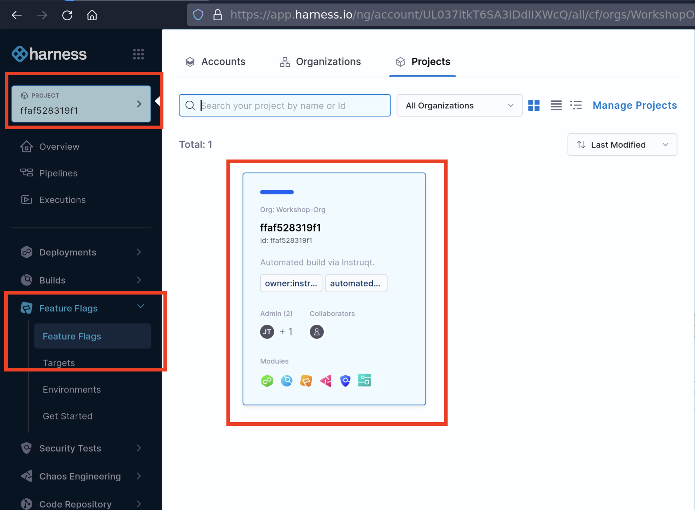

<style type="text/css" rel="stylesheet">
hr.cyan { background-color: cyan; color: cyan; height: 2px; margin-bottom: -10px; }
h2.cyan { color: cyan; }
</style><h2 class="cyan">Feature Releases with Feature Flags</h2>
<hr class="cyan">
<br>

> # Re-release with Feature Flags
Now, we will conduct the same actions but instead we will wrap this new caching feature behind a feature flag so that we can safely rollback.

># Navigate to the `Harness` Tab to Continue
1. From the left hand menu, go to **Projects &rarr; All Projects**
2. Select the pre-made project



3. Click **Save and Continue >** and **Save and Continue** again on the next screen
4. *This brings up the **Get Started** flow. For the purposes of this workshop we will skip that and create our Feature Flags from scratch. Click the 'X' in the upper right corner to close the pop-up.*
5. From the left hand menu, go to **Projects**, and click the Project selector in the secondary menu.
6. Search for your project (`<company_name>-<username>`) and select it.
7. Click into the Feature flags module on the left hand pane.
8. Expand **Project Setup** in the secondary navigation panel and select **Environments**
9.  Click **+New Environment** button.
10. Name your environment **development** and keep the Environment Type as **Non-production**.
11. Click **Create**
12. Click **+New SDK Key** on the SDK Keys pop-up screen.
13. Call your SDK key **development** and click **Create**
14. Click Feature Flags at the top of the secondary navigation pane on the left and click the **+New Feature Flag**
15. Select **Boolean** on the pop-up wizard
16. In the "About the flag" screen enter the name **cache_result** and click **Next>**
17. In the Variation setting screen, modify the value of the **If the flag is Enabled, serve** to **True** then click **Save and Close**
18. Run the following two commands to build a new Docker image and start the container
>**Important** Replace `<your_ff_key>` with the SDK key you copied in the prior step and make sure you're in the `cachingv2` branch.
>```
>git checkout cachingv2
>docker build -t weather-api .
>docker run -p 5000:5000 -e FF_KEY=<your_ff_key> weather-api
>```
1.  Open the **Sample App** tab and see the outputs for various cities.
  - Does it run fast or slow?
2.  Enable the feature in the Harness UI by navigating to **Feature Flags** in the secondary navigation pane and toggling the Feature Flag.
3.  Open the **Sample App** tab and see the outputs for various ciites.
  - Does it run fast or slow?
  - Do you still see the issue?
4.  Rollback the issue using the same Feature Flag toggle in the Harness UI
5.  Verify that the correct behavior has been restored

===============

Click the **Check** button to continue.
