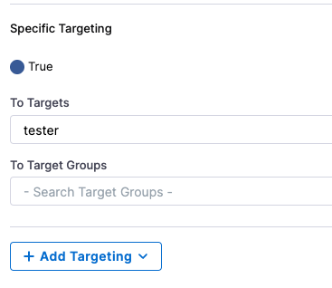
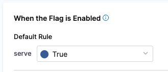

<style type="text/css" rel="stylesheet">
hr.cyan { background-color: cyan; color: cyan; height: 2px; margin-bottom: -10px; }
h2.cyan { color: cyan; }
</style><h2 class="cyan">Targeted Feature Releases</h2>
<hr class="cyan">
<br>

> # Introduce a Change
It's great that we have our feature behind a feature flag now to determine whether the feature is rolled out, but some users need this feature faster than others are are motivated to try it even if it's in more of a Beta stage. Lets see how we can get this feature to just those users.

> # Navigate to the `Code Editor` Tab to Continue
1. Run the following commands to build a new Docker image and starte the container, ensuring you replace the `<your_ff_key>` with the SDK key you previously copied in the prior lab and make sure you use the **cachingv3** branch.

>```
>git checkout cachingv3
>docker build -t weather-api .
>docker run -p 5000:5000 -e FF_KEY=<your_ff_key> weather-api
>```

2. Open the `Sample App` tab in your browser and see the outputs for various cities. Does it run fast or slow?
3. Enable the feature in the Harness UI by navigating to Feature Flags in the secondary navigation pane and toggling the Feature Flag for **cache_result**
4. Open the `Sample App` tab in your browser and see the outputs for various cities again. Does it run fast or slow? Do you still see the issue you saw before in step 3?
5. Rollback the issue using the toggle in the Harness UI.
6. Verify that the original behavior has been restored.

># Create a Targeted Change
1. Update the feature flag rules
   1. In the Harness UI, navigate to the Feature Flags in the secondary navigation on the left and click into the feature flag **cache_result**
   2. Change the feature default rule for **When the Flag is Enabled** to **False**. WHen complete, the Default Rule should look like this:
   
   3. Turn the flag on and click Save
   
2. Open the `Sample App` page in your browser and see the outputs for various cities. Does the caching take effect?
3. Click on "Login" in the upper left, and enter "tester" into the dialogue box.
4. Update the flag configuration's **Specific Targetting** to serve **True** to targets with the name **tester** and click **Save**.

5. Change your login from 'tester' to 'user' and back. Observe the caching behavior change: does it show up for both users?
6. Change the feature default rule for **When the Flag is Enabled** back to **True** and click **Save** on the new flag configuration.

7. Change your login from 'tester' to 'user' and back. Observe the caching behavior change: does it show up for both users?

># Create a Target Group
1. Navigate to the **Targets** in the secondary left hand navigation menu
2. Click into user "tester". Observe attributes on the left hand side
3. Click back in your browser and then click into user "user1". Observe *no* attributes on the left hand side
4. Navigate back to the **Targets** screen
5. Click **Target Groups** in the middle at the top of the screen
6. Click **+New Target Group** at the bottom to create a new group.
   1. Add name "beta" and click **Create**
   2. Under criteria click **Edit**
      1. Note the option to explicitly include or exclude named users
   3. Click **Add Rule**
   4. Create a rule for **opted-into-beta** equals **True**
   5. Save the criteria

># Front-end Feature Flags
1. Navigate to **Environments**
2. Under your development environment, create a new **Client** SDK key
3. In the UI for your application, click on the **Key** button and add your SDK Key. You might need to refresh the `Sample App` page to be sure this fully takes effect.
4. In the Feature Flags UI, create a new boolean flag with the identifier of `dark_mode` and set it to evaluate to **True** when it is toggled on.
5. Enable your new flag and observe the results in your application UI.

Congratulations! You are really able to take advantage of the power of Harness Feature Flags.

===============

Click the **Check** button to continue.
